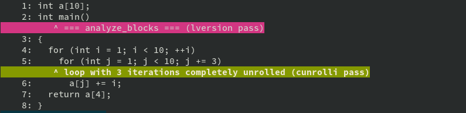

optmark
=======

To write optimized code in any compiled language requires understanding of
what the compiler does to one's code.  This is not an easy task even for
someone intimately familiar with the compiler due to the many interconnected
parts that make up a compiler.  In addition there are heuristics and rules
based on pattern matching which might depend on the exact way the source code
is written or which optimization passes have touched the code first.

With enough compiler knowledge it is sometimes/often possible to look at the source code and
the generated assembler code and determine the transformations which have been
performed.  Some transformations might not leave enough traces, though, and in
general is this approach only realistic for short code sequences.

To help getting insight the GCC developers (specifically David Malcolm) have
added a way to dump all kinds of information the compiler's optimization
passes produce.  This happens in a way that can be consumed by tools.

GCC Use
-------

Any program that compiles with GCC can be optimized and the optimizer, because
it is shared by all languages, can be told to emit the auxiliary information
useful for analysis.  This information is normally not generated and is not
needed nor wanted in the binary.  Instead, the data is written into a separate
JSON file.

    $ gcc -o just-write -O3 -fsave-optimization-record just-write.c -march=native
    $ ll just-write.c.opt-record.json.gz 
    -rw-rw-r--. 1 drepper drepper 5433 Sep 14 10:50 just-write.c.opt-record.json.gz

The generated file is a text file but looking at it directly is not particularly
helpful.  This is where this script comes in.

optmark
-------

The `optmark` Python script parses the information the the generated JSON file
and uses it to annotate the source code.  This shows which optimizations are
or are not performed for what parts of the source code.  This does **not**
explain why the decision is made and how the transformation has been
performed.  This is knowledge the consumer of the output has to bring with her.

Continuing the example above, the produced JSON file can be inspected like this

    $ optmark just-write.c.opt-record.json.gz

The output (assuming a color-capable terminal) looks something like this:

This is a small program which does not exhibit many annotations.  It shows,
though, that
1.  the compiler determined the inner loop is executed thrice, and
2.  that the inner loop is completely unrolled and hence removed.
That is the kind of information one wants to know when writing code.  If the
expectations are different it might mean different compiler settings have to
be used or the source code needs to be changed or annotated.

Limitations
-----------

The output of `optmark` does not fully represent all the optimization information.
While there are some limitations in the script itself it is usually the case that
the JSON file describing the optimizations is not complete.  This is unfortunately
the situation because the need to describe the optimizations is more recent than the
implementation of the optimizations themselves.  Retrofitting the generation of
the auxiliary information is time-consuming and also will need the assistance of
various GCC developers who are already very busy without this additional work.

It might be worthwhile filing bugs for missing information but even better,
contribute the necessary changes.  This is not easy but then what ever is?

Ulrich Drepper <drepper@gmail.com>
